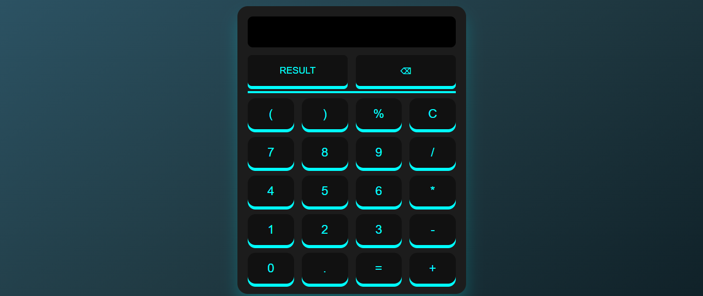

# 🧮 3D Neon Calculator

A modern, glowing 3D calculator built using *HTML, **CSS, and **JavaScript*. This calculator mimics a real-world UI with beautiful neon effects and interactive functionality.

---

## 📌 Table of Contents

- [Features](#-features)
- [Technologies Used](#-technologies-used)
- [File Structure](#-file-structure)
- [How to Run](#-how-to-run)
- [Screenshot](#-screenshot)
- [Author](#-author)
- [Support](#-Support)
---

## 🚀 Features

- ✅ Stylish 3D interface with glowing neon effects  
- ✅ Basic calculator operations: +, -, ×, ÷  
- ✅ Functional C (clear), backspace, percentage %, and = buttons  
- ✅ Works smoothly on modern web browsers  
- ✅ Responsive design for desktops and laptops  

---

## 🛠 Technologies Used

- *HTML5* – Structure of the calculator  
- *CSS3* – 3D design, layout, and neon glow effects  
- *JavaScript (Vanilla)* – Handles logic and button interaction  

---

## 📁 File Structure

|  FILE NAME          | Description                              |
|---------------------|------------------------------------------|
| Cal.html            | #HTML file for the structure             |
| Cal.css             | #CSS file for the style and neon effects |
| Cal.js              | #javascript file for the logic           | 

---

## ⚙ How to Run

Anyone can run this project easily by following these steps:

1. *Download or fork this repository*
   - Click the green Code button above and select *Download ZIP, or click **Fork* to clone it

2. *Open the folder*
   - Inside the folder, you will see the file named index.html

3. *Copy and paste the code*
   - Open the index.html file
   - Copy the full code from that file
   - Open your *VS Code* or any code editor you're using
   - Paste the code into a new HTML file
   - Save it and open it in your browser to see how the calculator performs

✅ That’s it — you're ready to explore and test the calculator!

---

## 📸 Screenshot

Here is the preview of my 3D Calculator:

---

## 🙋‍♂ Author

*Muhammad Umar Hassan*  
- 📚 BSCS Student | Frontend Learner  
- 🔗 https://www.linkedin.com/in/m-umarh
- 📧 mumarh135@gmail.com

---

## ⭐ Show Your Support

If you like this project, please:

- ⭐ Star this repository  
- 🍴 Fork it  
- 🧑‍💻 Share it with others

Thanks for visiting!

